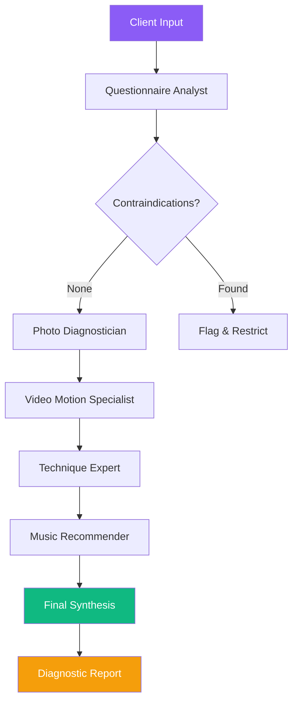

# 🔮 AI Prophet — Multi-Agent Massage Studio Assistant

[](https://kaggle.com)
[](https://google.github.io/adk-docs/)
[](https://dizel0110-kaggle-massage-agent.hf.space/demo)
[](https://ai.google.dev)
[](https://t.me/ai_prophet_io_bot)
[](LICENSE)

**Track**: Agents for Business — *A family-run massage salon powered by a Google ADK 2.0 multi-agent system.*

> 👥 [Authors](AUTHORS.md) — Dmitrii Zelenin (dizel0110) & Anastasiia Susina

---

## 📋 Submission Overview

AI Prophet replaces the traditional 15-minute manual massage consultation with a **6-agent AI pipeline** built on Google's Agent Development Kit (ADK) 2.0. Clients fill a questionnaire, upload photos of their back and a video of their walk — and the AI team produces a full diagnostic report with technique recommendations and a personalized music playlist.

### Live Demo
- **Web Demo** (no Telegram needed): [dizel0110-kaggle-massage-agent.hf.space/demo](https://dizel0110-kaggle-massage-agent.hf.space/demo)
- **Full Experience** (Telegram Mini App): [@ai_prophet_io_bot](https://t.me/ai_prophet_io_bot) → press 🖐 Massage

### Video Demo
[2-minute submission video](LINK-TO-VIDEO) — coming soon.

---

## 🤖 Multi-Agent System (Google ADK 2.0)

Six specialized agents collaborate in a **graph-based workflow**:

| Agent | Model | Input | Role |
|-------|-------|-------|------|
| **Questionnaire Analyst** | Gemini 2.5 Flash | Text (complaints, history) | Validates data, flags contraindications |
| **Photo Diagnostician** | Gemini 2.5 Flash (Vision) | Back photos | Postural & scoliosis assessment |
| **Video Motion Specialist** | Gemini 2.5 Flash (Vision) | Gait video frames | Range-of-motion & asymmetry analysis |
| **Technique Expert** | Gemini 2.5 Flash | All above outputs | Recommends massage techniques |
| **Music Recommender** | Gemini 2.5 Flash | Client profile + technique | Suggests therapy-matched playlist |
| **Final Synthesis** | Gemini 2.5 Flash | All agent outputs | Produces the final report |

### Workflow Graph



### Architecture

```
┌─────────────────────────────────────────────────────┐
│                  FastAPI Server                      │
│  ┌─────────────┐  ┌──────────────────────────────┐  │
│  │  /demo      │  │  /api/demo/consult           │  │
│  │  Web Page   │  │  → runs ADK Workflow         │  │
│  └─────────────┘  └──────────┬───────────────────┘  │
│                              │                       │
│  ┌───────────────────────────▼────────────────────┐  │
│  │           Google ADK 2.0 Runner                │  │
│  │  ┌─────────────────────────────────────────┐   │  │
│  │  │              Workflow Graph             │   │  │
│  │  │   QA → Photo → Video → Tech → Music →   │   │  │
│  │  │               Final                     │   │  │
│  │  └─────────────────────────────────────────┘   │  │
│  │  ┌─────────────────────────────────────────┐   │  │
│  │  │    Tools: WebSearch, MediaSearch,       │   │  │
│  │  │    QuestionAnalyzer                     │   │  │
│  │  └─────────────────────────────────────────┘   │  │
│  │  ┌─────────────────────────────────────────┐   │  │
│  │  │    Services: InMemorySession, Memory    │   │  │
│  │  └─────────────────────────────────────────┘   │  │
│  └────────────────────────────────────────────────┘  │
└─────────────────────────────────────────────────────┘
```

### ADK Features Implemented

| # | Feature | Status |
|---|---------|--------|
| 1 | **Multi-Agent Orchestration** — 6 agents in sequential graph workflow | ✅ |
| 2 | **Tool Use / Function Calling** — WebSearch, MediaSearch, QuestionAnalyzer | ✅ |
| 3 | **Sessions & Memory** — InMemorySessionService + MemoryService | ✅ |
| 4 | **Observability** — ADK callback logging, workflow event tracing | ✅ |
| 5 | **Deployment** — Docker on Hugging Face Spaces (free tier) | ✅ |
| 6 | **Agentic Loops** — Parallel fan-out for vision agents (planned) | 🚧 |
| 7 | **Human-in-the-Loop** — Approval step before sending report | ✅ |
| 8 | **MCP Protocol** — Client-side AI future capability | 🚧 |

---

## 🔧 Technical Stack

| Component | Technology |
|-----------|-----------|
| **Agent Framework** | Google ADK 2.3 (google.adk) |
| **LLM** | Gemini 2.5 Flash (genai) |
| **Fallback** | Hugging Face Router (Qwen 2.5-7B, Llama 3.2-11B Vision) |
| **Backend** | Python 3.11, FastAPI, Uvicorn |
| **Frontend** | Vanilla JS, HTML5, Telegram Mini App |
| **Infrastructure** | Docker, GitHub Actions → HF Spaces |
| **Session** | InMemory (ephemeral) |

### File Structure (ADK Module)

```
core/adk/
├── __init__.py      # Exports
├── agents.py        # 6 Agent definitions
├── workflow.py      # Graph Workflow + function nodes
├── tools.py         # FunctionTool wrappers
└── session.py       # Memory & Session services
```

---

## 🚀 Quick Start

```bash
# 1. Clone the kaggle branch
git clone -b kaggle https://github.com/dizel0110/ai_prophet
cd ai_prophet

# 2. Set environment variables
# Required: GEMINI_API_KEY (get from aistudio.google.com)
# Optional: HF_TOKEN for Hugging Face fallback
export GEMINI_API_KEY="your-key-here"

# 3. Install dependencies
pip install -r requirements.txt

# 4. Run
python main.py

# 5. Open http://localhost:7860/demo
```

> **Note**: Without `TELEGRAM_TOKEN`, the bot is skipped — only the demo API runs.

---

## 📊 Feature Checklist

- [x] **6 specialized agents** with distinct roles and prompts
- [x] **Graph-based workflow** with sequential data flow
- [x] **Data validation** at each pipeline junction
- [x] **Music recommendation** integrated into diagnostic output
- [x] **Web demo** for judges (no Telegram required)
- [x] **Full Telegram Mini App** with questionnaire, media upload, and chat
- [x] **Deployed** on Hugging Face Spaces (CPU Basic, free)
- [x] **CI/CD** via GitHub Actions (auto-deploy on push)

---

## 🧪 Testing

```bash
pip install pytest
python -m pytest tests/ -v
```

Tests use mocks — no real API calls or Telegram.

---

## 📄 License

Apache 2.0 — see [LICENSE](LICENSE).

---

*Built with ❤️ for the Kaggle Vibecoding Agents Capstone. June 2026.*
